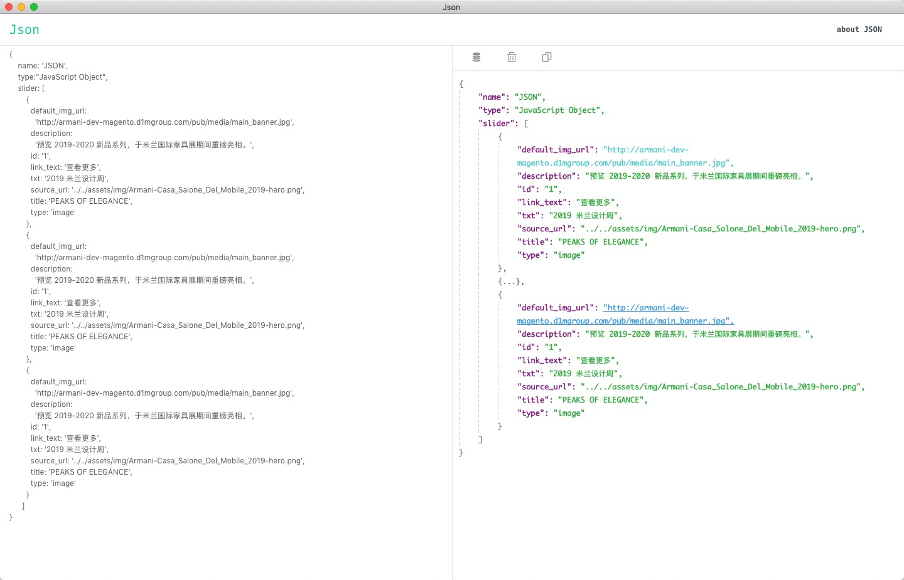

# JSON-Tool


主页：[https://github.com/Char-set/electron-json-tool](https://github.com/Char-set/electron-json-tool)

这是一个美化JSON小程序（暂时仅支持Mac），基于 [Electron-Vue](https://simulatedgreg.gitbooks.io/electron-vue/content/cn/) 开发，同时使用了 [Vue](https://cn.vuejs.org/)、[Element-Ui](https://element.eleme.cn/#/zh-CN) 

## 截图




## 功能特性

 - 美化JSON
 - JavaScript Object 对象转换 JSON
 - 待续


## 下载安装

你可以直接下载源码到本地运行或编辑，或者在下面下载可执行版本：

 - [JSON Tool 下载地址（百度网盘）](https://pan.baidu.com/s/1VuZpEGHdOPgb60awYSl0Pg)


## 运行/打包方法

### 环境配置（[推荐使用 yarn](https://yarn.bootcss.com/)）
 - 安装 [Node.js](https://nodejs.org/) 环境；
 - clone 仓库代码；
 - 在根目录 `./` 下，运行 `yarn install` 命令，安装开发依赖库；

    ```bash
    git clone https://github.com/Char-set/electron-json-tool.git

    cd electron-json-tool && yarn
    ```

### 运行

 - 在 `./` 目录下，运行 `yarn run dev` 命令，即可运行程序。

    ```bash
    # start in developer mode
    yarn run dev
    ```

### 打包发布

 - 建议使用 [electron-builder](https://github.com/electron-userland/electron-builder) 进行构建dmg文件

    ```bash
    yarn run build
    ```

 - 打包完成后，可运行的程序在 ./build 目录下

## 更新历史

### v1.0

 - 2019-06-10 引入 electron-store 储存用户上次输入的数据
 - 2019-06-06 发布 0.1.0 版，完成基本功能。


## 要做的事情

 - 当输入数据过大时，渲染JSON卡顿，待优化
 - 保存格式化的JSON文件到本地
 - XML 格式数据转换JSON，待支持
 - 支持 windows 

## 版权

本程序完全免费，并基于 MIT 协议开源。
